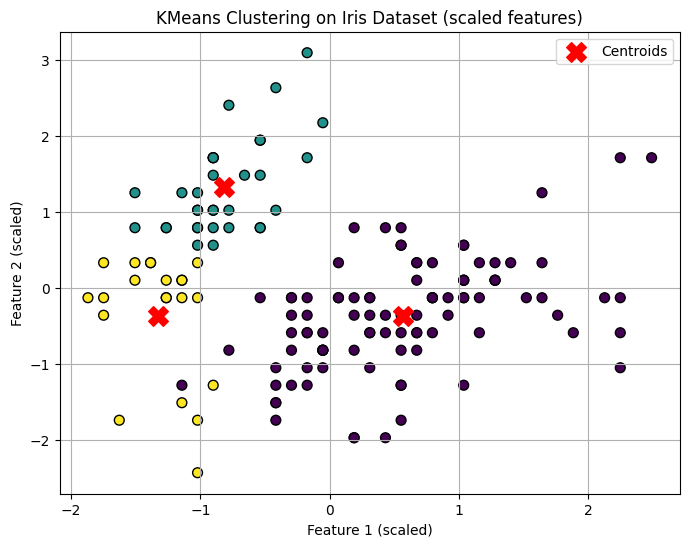
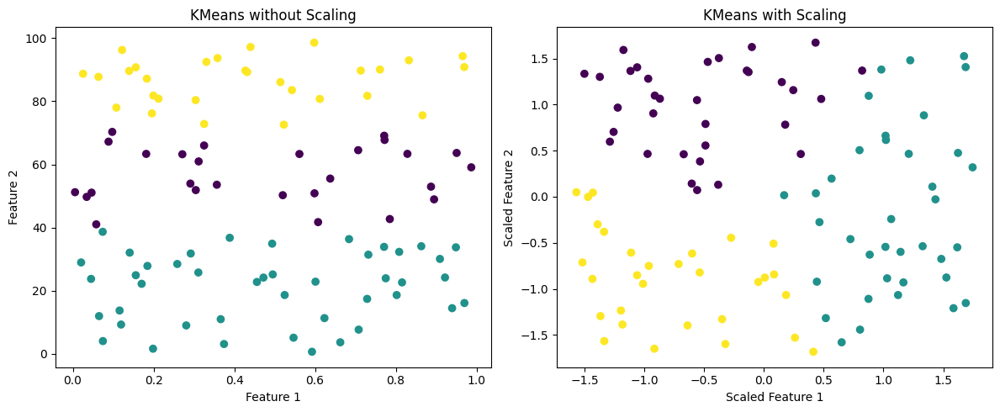
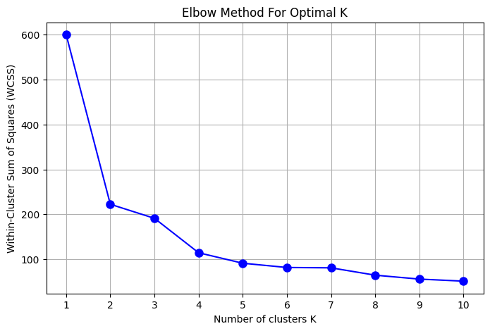
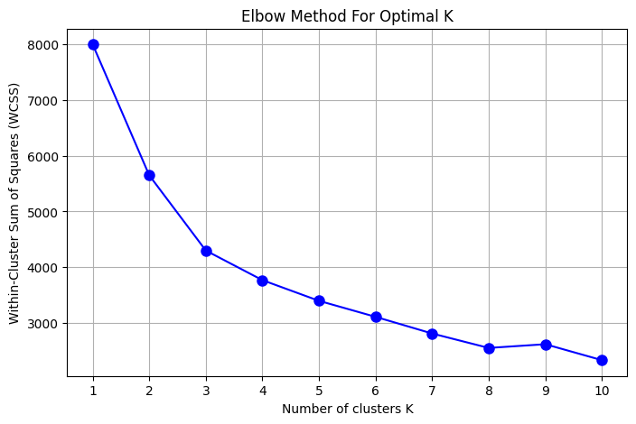
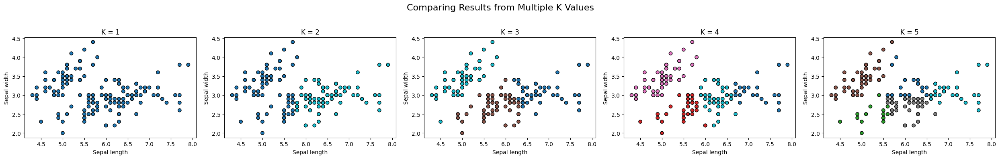
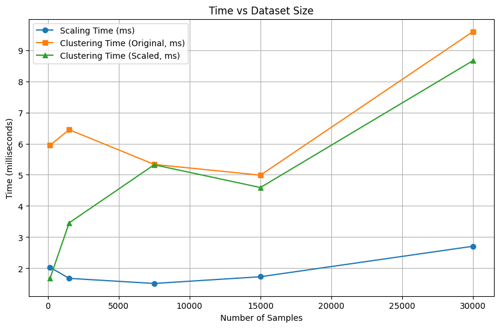

# Clustering :
Implement and analyze clustering techniques on the Iris dataset and synthetic data, focusing on:

- Understanding the impact of feature scaling.

- Identifying the optimal number of clusters.

- Comparing clustering behavior on different dataset sizes.

- Measuring computational time for scaling and clustering as data size grows.


### Installing Libraries 


```python
import sys
!{sys.executable} -m pip install numpy 

```

    Requirement already satisfied: numpy in /opt/homebrew/Cellar/jupyterlab/4.4.5/libexec/lib/python3.13/site-packages (2.3.2)


```python
!{sys.executable} -m pip install pandas matplotlib scikit-learn
```

    Collecting pandas
      Downloading pandas-2.3.1-cp313-cp313-macosx_11_0_arm64.whl.metadata (91 kB)
    Collecting matplotlib
      Downloading matplotlib-3.10.5-cp313-cp313-macosx_11_0_arm64.whl.metadata (11 kB)
    Collecting scikit-learn
      Downloading scikit_learn-1.7.1-cp313-cp313-macosx_12_0_arm64.whl.metadata (11 kB)
    Requirement already satisfied: numpy>=1.26.0 in /opt/homebrew/Cellar/jupyterlab/4.4.5/libexec/lib/python3.13/site-packages (from pandas) (2.3.2)
    Requirement already satisfied: python-dateutil>=2.8.2 in /opt/homebrew/Cellar/jupyterlab/4.4.5/libexec/lib/python3.13/site-packages (from pandas) (2.9.0.post0)
    Collecting pytz>=2020.1 (from pandas)
      Downloading pytz-2025.2-py2.py3-none-any.whl.metadata (22 kB)
    Collecting tzdata>=2022.7 (from pandas)
      Downloading tzdata-2025.2-py2.py3-none-any.whl.metadata (1.4 kB)
    Collecting contourpy>=1.0.1 (from matplotlib)
      Downloading contourpy-1.3.3-cp313-cp313-macosx_11_0_arm64.whl.metadata (5.5 kB)
    Collecting cycler>=0.10 (from matplotlib)
      Downloading cycler-0.12.1-py3-none-any.whl.metadata (3.8 kB)
    Collecting fonttools>=4.22.0 (from matplotlib)
      Downloading fonttools-4.59.0-cp313-cp313-macosx_10_13_universal2.whl.metadata (107 kB)
    Collecting kiwisolver>=1.3.1 (from matplotlib)
      Downloading kiwisolver-1.4.8-cp313-cp313-macosx_11_0_arm64.whl.metadata (6.2 kB)
    Requirement already satisfied: packaging>=20.0 in /opt/homebrew/Cellar/jupyterlab/4.4.5/libexec/lib/python3.13/site-packages (from matplotlib) (25.0)
    Collecting pillow>=8 (from matplotlib)
      Downloading pillow-11.3.0-cp313-cp313-macosx_11_0_arm64.whl.metadata (9.0 kB)
    Collecting pyparsing>=2.3.1 (from matplotlib)
      Downloading pyparsing-3.2.3-py3-none-any.whl.metadata (5.0 kB)
    Collecting scipy>=1.8.0 (from scikit-learn)
      Downloading scipy-1.16.1-cp313-cp313-macosx_14_0_arm64.whl.metadata (61 kB)
    Collecting joblib>=1.2.0 (from scikit-learn)
      Downloading joblib-1.5.1-py3-none-any.whl.metadata (5.6 kB)
    Collecting threadpoolctl>=3.1.0 (from scikit-learn)
      Downloading threadpoolctl-3.6.0-py3-none-any.whl.metadata (13 kB)
    Requirement already satisfied: six>=1.5 in /opt/homebrew/Cellar/jupyterlab/4.4.5/libexec/lib/python3.13/site-packages (from python-dateutil>=2.8.2->pandas) (1.17.0)
    Downloading pandas-2.3.1-cp313-cp313-macosx_11_0_arm64.whl (10.7 MB)
       ━━━━━━━━━━━━━━━━━━━━━━━━━━━━━━━━━━━━━━━━ 10.7/10.7 MB 9.9 MB/s eta 0:00:00:00:010:01
    [?25hDownloading matplotlib-3.10.5-cp313-cp313-macosx_11_0_arm64.whl (8.1 MB)
       ━━━━━━━━━━━━━━━━━━━━━━━━━━━━━━━━━━━━━━━━ 8.1/8.1 MB 9.4 MB/s eta 0:00:00a 0:00:01
    [?25hDownloading scikit_learn-1.7.1-cp313-cp313-macosx_12_0_arm64.whl (8.6 MB)
       ━━━━━━━━━━━━━━━━━━━━━━━━━━━━━━━━━━━━━━━━ 8.6/8.6 MB 7.5 MB/s eta 0:00:0000:0100:01
    [?25hDownloading contourpy-1.3.3-cp313-cp313-macosx_11_0_arm64.whl (274 kB)
    Downloading cycler-0.12.1-py3-none-any.whl (8.3 kB)
    Downloading fonttools-4.59.0-cp313-cp313-macosx_10_13_universal2.whl (2.8 MB)
       ━━━━━━━━━━━━━━━━━━━━━━━━━━━━━━━━━━━━━━━━ 2.8/2.8 MB 9.2 MB/s eta 0:00:00a 0:00:01
    [?25hDownloading joblib-1.5.1-py3-none-any.whl (307 kB)
    Downloading kiwisolver-1.4.8-cp313-cp313-macosx_11_0_arm64.whl (65 kB)
    Downloading pillow-11.3.0-cp313-cp313-macosx_11_0_arm64.whl (4.7 MB)
       ━━━━━━━━━━━━━━━━━━━━━━━━━━━━━━━━━━━━━━━━ 4.7/4.7 MB 9.1 MB/s eta 0:00:00ta 0:00:01
    [?25hDownloading pyparsing-3.2.3-py3-none-any.whl (111 kB)
    Downloading pytz-2025.2-py2.py3-none-any.whl (509 kB)
    Downloading scipy-1.16.1-cp313-cp313-macosx_14_0_arm64.whl (20.8 MB)
       ━━━━━━━━━━━━━━━━━━━━━━━━━━━━━━━━━━━━━━━━ 20.8/20.8 MB 9.8 MB/s eta 0:00:00a 0:00:01m
    [?25hDownloading threadpoolctl-3.6.0-py3-none-any.whl (18 kB)
    Downloading tzdata-2025.2-py2.py3-none-any.whl (347 kB)
    Installing collected packages: pytz, tzdata, threadpoolctl, scipy, pyparsing, pillow, kiwisolver, joblib, fonttools, cycler, contourpy, scikit-learn, pandas, matplotlib
       ━━━━━━━━━━━━━━━━━━━━━━━━━━━━━━━━━━━━━━━━ 14/14 [matplotlib]4 [matplotlib]n]
    Successfully installed contourpy-1.3.3 cycler-0.12.1 fonttools-4.59.0 joblib-1.5.1 kiwisolver-1.4.8 matplotlib-3.10.5 pandas-2.3.1 pillow-11.3.0 pyparsing-3.2.3 pytz-2025.2 scikit-learn-1.7.1 scipy-1.16.1 threadpoolctl-3.6.0 tzdata-2025.2


Data Preparation & Clustering :
-Loaded the Iris dataset (4 features, 3 true classes).

-Applied StandardScaler for feature normalization.

-Performed KMeans clustering with 3 clusters on scaled data.

-Visualized clusters with centroids on the first two scaled features.


### Load Iris dataset


```python
from sklearn.datasets import load_iris
iris = load_iris()
X = iris.data  # 4 features
y_true = iris.target  # True species labels (for reference)

print(iris)

```

    {'data': array([[5.1, 3.5, 1.4, 0.2],
           [4.9, 3. , 1.4, 0.2],
           [4.7, 3.2, 1.3, 0.2],
           [4.6, 3.1, 1.5, 0.2],
           [5. , 3.6, 1.4, 0.2],
           [5.4, 3.9, 1.7, 0.4],
           [4.6, 3.4, 1.4, 0.3],
           [5. , 3.4, 1.5, 0.2],
           [4.4, 2.9, 1.4, 0.2],
           [4.9, 3.1, 1.5, 0.1],
           [5.4, 3.7, 1.5, 0.2],
           [4.8, 3.4, 1.6, 0.2],
           [4.8, 3. , 1.4, 0.1],
           [4.3, 3. , 1.1, 0.1],
           [5.8, 4. , 1.2, 0.2],
           [5.7, 4.4, 1.5, 0.4],
           [5.4, 3.9, 1.3, 0.4],
           [5.1, 3.5, 1.4, 0.3],
           [5.7, 3.8, 1.7, 0.3],
           [5.1, 3.8, 1.5, 0.3],
           [5.4, 3.4, 1.7, 0.2],
           [5.1, 3.7, 1.5, 0.4],
           [4.6, 3.6, 1. , 0.2],
           [5.1, 3.3, 1.7, 0.5],
           [4.8, 3.4, 1.9, 0.2],
           [5. , 3. , 1.6, 0.2],
           [5. , 3.4, 1.6, 0.4],
           [5.2, 3.5, 1.5, 0.2],
           [5.2, 3.4, 1.4, 0.2],
           [4.7, 3.2, 1.6, 0.2],
           [4.8, 3.1, 1.6, 0.2],
           [5.4, 3.4, 1.5, 0.4],
           [5.2, 4.1, 1.5, 0.1],
           [5.5, 4.2, 1.4, 0.2],
           [4.9, 3.1, 1.5, 0.2],
           [5. , 3.2, 1.2, 0.2],
           [5.5, 3.5, 1.3, 0.2],
           [4.9, 3.6, 1.4, 0.1],
           [4.4, 3. , 1.3, 0.2],
           [5.1, 3.4, 1.5, 0.2],
           [5. , 3.5, 1.3, 0.3],
           [4.5, 2.3, 1.3, 0.3],
           [4.4, 3.2, 1.3, 0.2],
           [5. , 3.5, 1.6, 0.6],
           [5.1, 3.8, 1.9, 0.4],
           [4.8, 3. , 1.4, 0.3],
           [5.1, 3.8, 1.6, 0.2],
           [4.6, 3.2, 1.4, 0.2],
           [5.3, 3.7, 1.5, 0.2],
           [5. , 3.3, 1.4, 0.2],
           [7. , 3.2, 4.7, 1.4],
           [6.4, 3.2, 4.5, 1.5],
           [6.9, 3.1, 4.9, 1.5],
           [5.5, 2.3, 4. , 1.3],
           [6.5, 2.8, 4.6, 1.5],
           [5.7, 2.8, 4.5, 1.3],
           [6.3, 3.3, 4.7, 1.6],
           [4.9, 2.4, 3.3, 1. ],
           [6.6, 2.9, 4.6, 1.3],
           [5.2, 2.7, 3.9, 1.4],
           [5. , 2. , 3.5, 1. ],
           [5.9, 3. , 4.2, 1.5],
           [6. , 2.2, 4. , 1. ],
           [6.1, 2.9, 4.7, 1.4],
           [5.6, 2.9, 3.6, 1.3],
           [6.7, 3.1, 4.4, 1.4],
           [5.6, 3. , 4.5, 1.5],
           [5.8, 2.7, 4.1, 1. ],
           [6.2, 2.2, 4.5, 1.5],
           [5.6, 2.5, 3.9, 1.1],
           [5.9, 3.2, 4.8, 1.8],
           [6.1, 2.8, 4. , 1.3],
           [6.3, 2.5, 4.9, 1.5],
           [6.1, 2.8, 4.7, 1.2],
           [6.4, 2.9, 4.3, 1.3],
           [6.6, 3. , 4.4, 1.4],
           [6.8, 2.8, 4.8, 1.4],
           [6.7, 3. , 5. , 1.7],
           [6. , 2.9, 4.5, 1.5],
           [5.7, 2.6, 3.5, 1. ],
           [5.5, 2.4, 3.8, 1.1],
           [5.5, 2.4, 3.7, 1. ],
           [5.8, 2.7, 3.9, 1.2],
           [6. , 2.7, 5.1, 1.6],
           [5.4, 3. , 4.5, 1.5],
           [6. , 3.4, 4.5, 1.6],
           [6.7, 3.1, 4.7, 1.5],
           [6.3, 2.3, 4.4, 1.3],
           [5.6, 3. , 4.1, 1.3],
           [5.5, 2.5, 4. , 1.3],
           [5.5, 2.6, 4.4, 1.2],
           [6.1, 3. , 4.6, 1.4],
           [5.8, 2.6, 4. , 1.2],
           [5. , 2.3, 3.3, 1. ],
           [5.6, 2.7, 4.2, 1.3],
           [5.7, 3. , 4.2, 1.2],
           [5.7, 2.9, 4.2, 1.3],
           [6.2, 2.9, 4.3, 1.3],
           [5.1, 2.5, 3. , 1.1],
           [5.7, 2.8, 4.1, 1.3],
           [6.3, 3.3, 6. , 2.5],
           [5.8, 2.7, 5.1, 1.9],
           [7.1, 3. , 5.9, 2.1],
           [6.3, 2.9, 5.6, 1.8],
           [6.5, 3. , 5.8, 2.2],
           [7.6, 3. , 6.6, 2.1],
           [4.9, 2.5, 4.5, 1.7],
           [7.3, 2.9, 6.3, 1.8],
           [6.7, 2.5, 5.8, 1.8],
           [7.2, 3.6, 6.1, 2.5],
           [6.5, 3.2, 5.1, 2. ],
           [6.4, 2.7, 5.3, 1.9],
           [6.8, 3. , 5.5, 2.1],
           [5.7, 2.5, 5. , 2. ],
           [5.8, 2.8, 5.1, 2.4],
           [6.4, 3.2, 5.3, 2.3],
           [6.5, 3. , 5.5, 1.8],
           [7.7, 3.8, 6.7, 2.2],
           [7.7, 2.6, 6.9, 2.3],
           [6. , 2.2, 5. , 1.5],
           [6.9, 3.2, 5.7, 2.3],
           [5.6, 2.8, 4.9, 2. ],
           [7.7, 2.8, 6.7, 2. ],
           [6.3, 2.7, 4.9, 1.8],
           [6.7, 3.3, 5.7, 2.1],
           [7.2, 3.2, 6. , 1.8],
           [6.2, 2.8, 4.8, 1.8],
           [6.1, 3. , 4.9, 1.8],
           [6.4, 2.8, 5.6, 2.1],
           [7.2, 3. , 5.8, 1.6],
           [7.4, 2.8, 6.1, 1.9],
           [7.9, 3.8, 6.4, 2. ],
           [6.4, 2.8, 5.6, 2.2],
           [6.3, 2.8, 5.1, 1.5],
           [6.1, 2.6, 5.6, 1.4],
           [7.7, 3. , 6.1, 2.3],
           [6.3, 3.4, 5.6, 2.4],
           [6.4, 3.1, 5.5, 1.8],
           [6. , 3. , 4.8, 1.8],
           [6.9, 3.1, 5.4, 2.1],
           [6.7, 3.1, 5.6, 2.4],
           [6.9, 3.1, 5.1, 2.3],
           [5.8, 2.7, 5.1, 1.9],
           [6.8, 3.2, 5.9, 2.3],
           [6.7, 3.3, 5.7, 2.5],
           [6.7, 3. , 5.2, 2.3],
           [6.3, 2.5, 5. , 1.9],
           [6.5, 3. , 5.2, 2. ],
           [6.2, 3.4, 5.4, 2.3],
           [5.9, 3. , 5.1, 1.8]]), 'target': array([0, 0, 0, 0, 0, 0, 0, 0, 0, 0, 0, 0, 0, 0, 0, 0, 0, 0, 0, 0, 0, 0,
           0, 0, 0, 0, 0, 0, 0, 0, 0, 0, 0, 0, 0, 0, 0, 0, 0, 0, 0, 0, 0, 0,
           0, 0, 0, 0, 0, 0, 1, 1, 1, 1, 1, 1, 1, 1, 1, 1, 1, 1, 1, 1, 1, 1,
           1, 1, 1, 1, 1, 1, 1, 1, 1, 1, 1, 1, 1, 1, 1, 1, 1, 1, 1, 1, 1, 1,
           1, 1, 1, 1, 1, 1, 1, 1, 1, 1, 1, 1, 2, 2, 2, 2, 2, 2, 2, 2, 2, 2,
           2, 2, 2, 2, 2, 2, 2, 2, 2, 2, 2, 2, 2, 2, 2, 2, 2, 2, 2, 2, 2, 2,
           2, 2, 2, 2, 2, 2, 2, 2, 2, 2, 2, 2, 2, 2, 2, 2, 2, 2]), 'frame': None, 'target_names': array(['setosa', 'versicolor', 'virginica'], dtype='<U10'), 'DESCR': '.. _iris_dataset:\n\nIris plants dataset\n--------------------\n\n**Data Set Characteristics:**\n\n:Number of Instances: 150 (50 in each of three classes)\n:Number of Attributes: 4 numeric, predictive attributes and the class\n:Attribute Information:\n    - sepal length in cm\n    - sepal width in cm\n    - petal length in cm\n    - petal width in cm\n    - class:\n            - Iris-Setosa\n            - Iris-Versicolour\n            - Iris-Virginica\n\n:Summary Statistics:\n\n============== ==== ==== ======= ===== ====================\n                Min  Max   Mean    SD   Class Correlation\n============== ==== ==== ======= ===== ====================\nsepal length:   4.3  7.9   5.84   0.83    0.7826\nsepal width:    2.0  4.4   3.05   0.43   -0.4194\npetal length:   1.0  6.9   3.76   1.76    0.9490  (high!)\npetal width:    0.1  2.5   1.20   0.76    0.9565  (high!)\n============== ==== ==== ======= ===== ====================\n\n:Missing Attribute Values: None\n:Class Distribution: 33.3% for each of 3 classes.\n:Creator: R.A. Fisher\n:Donor: Michael Marshall (MARSHALL%PLU@io.arc.nasa.gov)\n:Date: July, 1988\n\nThe famous Iris database, first used by Sir R.A. Fisher. The dataset is taken\nfrom Fisher\'s paper. Note that it\'s the same as in R, but not as in the UCI\nMachine Learning Repository, which has two wrong data points.\n\nThis is perhaps the best known database to be found in the\npattern recognition literature.  Fisher\'s paper is a classic in the field and\nis referenced frequently to this day.  (See Duda & Hart, for example.)  The\ndata set contains 3 classes of 50 instances each, where each class refers to a\ntype of iris plant.  One class is linearly separable from the other 2; the\nlatter are NOT linearly separable from each other.\n\n.. dropdown:: References\n\n  - Fisher, R.A. "The use of multiple measurements in taxonomic problems"\n    Annual Eugenics, 7, Part II, 179-188 (1936); also in "Contributions to\n    Mathematical Statistics" (John Wiley, NY, 1950).\n  - Duda, R.O., & Hart, P.E. (1973) Pattern Classification and Scene Analysis.\n    (Q327.D83) John Wiley & Sons.  ISBN 0-471-22361-1.  See page 218.\n  - Dasarathy, B.V. (1980) "Nosing Around the Neighborhood: A New System\n    Structure and Classification Rule for Recognition in Partially Exposed\n    Environments".  IEEE Transactions on Pattern Analysis and Machine\n    Intelligence, Vol. PAMI-2, No. 1, 67-71.\n  - Gates, G.W. (1972) "The Reduced Nearest Neighbor Rule".  IEEE Transactions\n    on Information Theory, May 1972, 431-433.\n  - See also: 1988 MLC Proceedings, 54-64.  Cheeseman et al"s AUTOCLASS II\n    conceptual clustering system finds 3 classes in the data.\n  - Many, many more ...\n', 'feature_names': ['sepal length (cm)', 'sepal width (cm)', 'petal length (cm)', 'petal width (cm)'], 'filename': 'iris.csv', 'data_module': 'sklearn.datasets.data'}


### Scale features (important for distance-based clustering)
. Impact of Scaling on Clustering
Created synthetic data with features on very different scales to demonstrate how scaling influences clustering:

 - Without scaling, KMeans tends to cluster based on the dominant scale feature.

 - After scaling, clusters reflect meaningful grouping across features.

Visual comparison of clustering on raw vs scaled data shows clear differences.


```python
from sklearn.preprocessing import StandardScaler
scaler = StandardScaler()
X_scaled = scaler.fit_transform(X)

```

### Apply KMeans with 3 clusters


```python
from sklearn.cluster import KMeans
kmeans = KMeans(n_clusters=3, random_state=42)
clusters = kmeans.fit_predict(X_scaled)

```

### Visualize the clustering result on first two principal features


```python
import matplotlib.pyplot as plt
plt.figure(figsize=(8,6))
plt.scatter(X_scaled[:, 0], X_scaled[:, 1], c=clusters, cmap='viridis', edgecolor='k', s=50)
plt.scatter(kmeans.cluster_centers_[:, 0], kmeans.cluster_centers_[:, 1], c='red', marker='X', s=200, label='Centroids')
plt.title('KMeans Clustering on Iris Dataset (scaled features)')
plt.xlabel('Feature 1 (scaled)')
plt.ylabel('Feature 2 (scaled)')
plt.legend()
plt.grid(True)
plt.show()

```


    

    


## Scaled and Not Scaled Differences : 


```python
import numpy as np
import matplotlib.pyplot as plt
from sklearn.cluster import KMeans
from sklearn.preprocessing import StandardScaler

# Create synthetic data with different scales
np.random.seed(42)
x1 = np.random.rand(100, 1)           # Feature 1: 0–1
x2 = 100 * np.random.rand(100, 1)     # Feature 2: 0–100
X = np.hstack((x1, x2))

# KMeans without scaling
kmeans_raw = KMeans(n_clusters=3, random_state=42)
labels_raw = kmeans_raw.fit_predict(X)

# KMeans with scaling
scaler = StandardScaler()
X_scaled = scaler.fit_transform(X)
kmeans_scaled = KMeans(n_clusters=3, random_state=42)
labels_scaled = kmeans_scaled.fit_predict(X_scaled)

# Plot without scaling
plt.figure(figsize=(12, 5))
plt.subplot(1, 2, 1)
plt.scatter(X[:, 0], X[:, 1], c=labels_raw, cmap='viridis')
plt.title("KMeans without Scaling")
plt.xlabel("Feature 1")
plt.ylabel("Feature 2")

# Plot with scaling
plt.subplot(1, 2, 2)
plt.scatter(X_scaled[:, 0], X_scaled[:, 1], c=labels_scaled, cmap='viridis')
plt.title("KMeans with Scaling")
plt.xlabel("Scaled Feature 1")
plt.ylabel("Scaled Feature 2")

plt.tight_layout()
plt.show()

```


    

    


### Identifying the Optimum Number of Clusters :


```python
import matplotlib.pyplot as plt
from sklearn.cluster import KMeans

def plot_elbow_method(X, max_k=10):
    wcss = []
    K_range = range(1, max_k+1)
    
    for k in K_range:
        kmeans = KMeans(n_clusters=k, random_state=42)
        kmeans.fit(X)
        wcss.append(kmeans.inertia_)  # Sum of squared distances to closest cluster center
    
    plt.figure(figsize=(8,5))
    plt.plot(K_range, wcss, 'bo-', markersize=8)
    plt.xlabel('Number of clusters K')
    plt.ylabel('Within-Cluster Sum of Squares (WCSS)')
    plt.title('Elbow Method For Optimal K')
    plt.xticks(K_range)
    plt.grid(True)
    plt.show()
```


```python
# Example usage with Iris data X_scaled:
plot_elbow_method(X_scaled, max_k=10)

```


    

    


### Determining the Optimal Number of Clusters on a Large Synthetic Dataset
Used the Elbow Method by plotting Within-Cluster Sum of Squares (WCSS) for K values from 1 to 10:


```python
from sklearn.datasets import make_classification
from sklearn.preprocessing import StandardScaler

# 1. Generate larger synthetic dataset
X_large, y_large = make_classification(
    n_samples=2000,   # large sample size
    n_features=4,     # same number of features as Iris
    n_informative=4,
    n_redundant=0,
    n_clusters_per_class=1,
    n_classes=4,      # number of classes, optional
    random_state=42
)

# 2. Scale the features
scaler = StandardScaler()
X_large_scaled = scaler.fit_transform(X_large)

# 3. Use the elbow method plot function on the large data
plot_elbow_method(X_large_scaled, max_k=10)

```


    

    


### Comparing Clustering Results Across Different K Values on the Original Iris Dataset
Visualized cluster assignments on Iris (first two features) for multiple K values (1 to 5), showing how cluster boundaries evolve and separate:


```python
import matplotlib.pyplot as plt
from sklearn.datasets import load_iris
from sklearn.cluster import KMeans

# Load Iris data (using only first two features for 2D plot)
iris = load_iris()
X = iris.data[:, :2]  # first two features

def plot_kmeans_multiple_k(X, k_values):
    n_plots = len(k_values)
    fig, axes = plt.subplots(1, n_plots, figsize=(5 * n_plots, 4))
    
    if n_plots == 1:
        axes = [axes]  # make it iterable
    
    for ax, k in zip(axes, k_values):
        kmeans = KMeans(n_clusters=k, random_state=42)
        labels = kmeans.fit_predict(X)
        
        scatter = ax.scatter(X[:, 0], X[:, 1], c=labels, cmap='tab10', edgecolor='k')
        ax.set_title(f'K = {k}')
        ax.set_xlabel('Sepal length')
        ax.set_ylabel('Sepal width')
    
    fig.suptitle("Comparing Results from Multiple K Values", fontsize=16)
    plt.tight_layout(rect=[0, 0, 1, 0.95])
    plt.show()

# Example usage:
k_values = [1,2, 3, 4, 5]
plot_kmeans_multiple_k(X, k_values)

```


    

    


## Measuring Scaling and Clustering Time vs Dataset Size
This code measures how long it takes to scale data and run KMeans clustering on increasing dataset sizes (created by repeating the Iris dataset). It compares:
 - Time to scale the data (standardization)
 - Clustering time on original data
 - Clustering time on scaled data

The results are plotted to show how processing time grows with more samples, helping to understand the impact of scaling and dataset size on clustering performance.


```python
import time
import numpy as np
import matplotlib.pyplot as plt
from sklearn.datasets import load_iris
from sklearn.preprocessing import StandardScaler
from sklearn.cluster import KMeans

# Load Iris data
iris = load_iris()
X_original = iris.data

def measure_times_vs_data_size(sizes, n_clusters=3):
    scaling_times = []
    clustering_times_orig = []
    clustering_times_scaled = []
    sample_counts = []

    for scale_factor in sizes:
        # Generate larger dataset by repeating iris data
        X_large = np.tile(X_original, (scale_factor, 1))
        sample_count = X_large.shape[0]
        sample_counts.append(sample_count)

        scaler = StandardScaler()

        # Measure scaling time
        start = time.time()
        X_scaled = scaler.fit_transform(X_large)
        end = time.time()
        scaling_time = (end - start) * 1000  # convert to milliseconds
        scaling_times.append(scaling_time)

        # Measure clustering time on original data
        kmeans_orig = KMeans(n_clusters=n_clusters, random_state=42)
        start = time.time()
        kmeans_orig.fit(X_large)
        end = time.time()
        clustering_orig_time = (end - start) * 1000
        clustering_times_orig.append(clustering_orig_time)

        # Measure clustering time on scaled data
        kmeans_scaled = KMeans(n_clusters=n_clusters, random_state=42)
        start = time.time()
        kmeans_scaled.fit(X_scaled)
        end = time.time()
        clustering_scaled_time = (end - start) * 1000
        clustering_times_scaled.append(clustering_scaled_time)

        print(f"Samples: {sample_count}, Scaling time: {scaling_time:.2f} ms, Clustering time original: {clustering_orig_time:.2f} ms, Clustering time scaled: {clustering_scaled_time:.2f} ms")

    # Plot results
    plt.figure(figsize=(10, 6))
    plt.plot(sample_counts, scaling_times, 'o-', label='Scaling Time (ms)')
    plt.plot(sample_counts, clustering_times_orig, 's-', label='Clustering Time (Original, ms)')
    plt.plot(sample_counts, clustering_times_scaled, '^-', label='Clustering Time (Scaled, ms)')
    plt.xlabel('Number of Samples')
    plt.ylabel('Time (milliseconds)')
    plt.title('Time vs Dataset Size')
    plt.legend()
    plt.grid(True)
    plt.show()

# Scale factors for repeating Iris data (1x to 200x)
sizes = [1, 10, 50, 100, 200]

measure_times_vs_data_size(sizes)

```

    Samples: 150, Scaling time: 2.03 ms, Clustering time original: 5.95 ms, Clustering time scaled: 1.68 ms
    Samples: 1500, Scaling time: 1.68 ms, Clustering time original: 6.45 ms, Clustering time scaled: 3.46 ms
    Samples: 7500, Scaling time: 1.51 ms, Clustering time original: 5.33 ms, Clustering time scaled: 5.32 ms
    Samples: 15000, Scaling time: 1.73 ms, Clustering time original: 4.99 ms, Clustering time scaled: 4.59 ms
    Samples: 30000, Scaling time: 2.71 ms, Clustering time original: 9.59 ms, Clustering time scaled: 8.66 ms


    

    


```python

```
