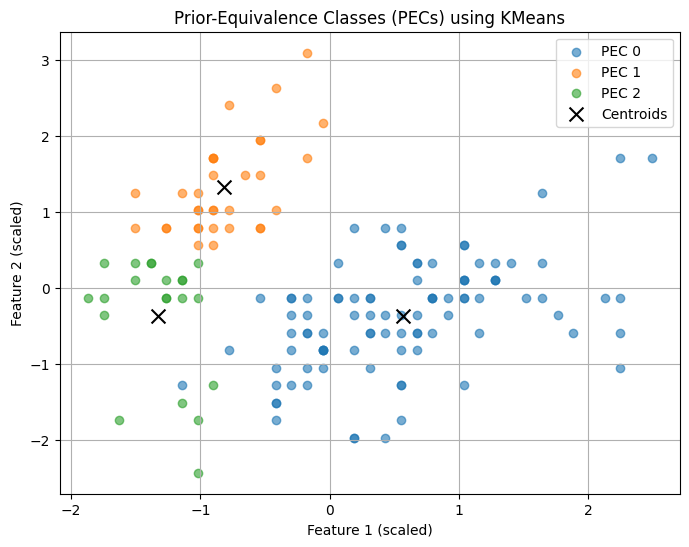
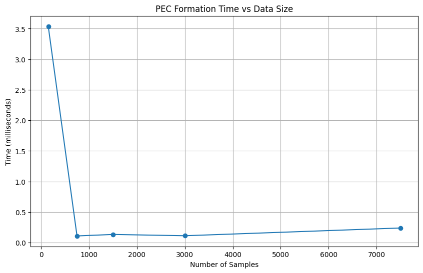

### Prior-Equivalence Classes (PEC) – Step Overview :

In this step, we generate Prior-Equivalence Classes (PECs) as part of the CoVerNet structure. The goal is to group input samples that are similar according to clustering in the input space. This helps define meaningful neighborhoods for later property generation and formal analysis.

Loaded the Iris dataset and applied feature scaling using StandardScaler for better clustering performance.

Applied KMeans clustering with k=3 clusters, consistent with the three Iris species.

Defined a function form_equivalence_classes() to create PECs by grouping data points and associating them with their cluster centroids.


```python
# Step 0: Re-do Clustering Briefly (as preparation for PEC)
from sklearn.datasets import load_iris
from sklearn.preprocessing import StandardScaler
from sklearn.cluster import KMeans
import numpy as np

# Load the Iris dataset
iris = load_iris()
X = iris.data

# Scale the features
scaler = StandardScaler()
X_scaled = scaler.fit_transform(X)

# Perform KMeans clustering (e.g., k=3)
kmeans = KMeans(n_clusters=3, random_state=42)
clusters = kmeans.fit_predict(X_scaled)
```


```python
def form_equivalence_classes(X, cluster_labels, centroids):
    """
    Forms Prior-Equivalence Classes (PECs) from clustering results.

    Parameters:
    - X: Scaled input data.
    - cluster_labels: Labels assigned by KMeans.
    - centroids: Cluster centroids from KMeans.

    Returns:
    - Dictionary mapping cluster ID to its centroid and member data points.
    """
    classes = {}
    for label in np.unique(cluster_labels):
        members = X[cluster_labels == label]
        centroid = centroids[label]
        classes[label] = {
            "centroid": centroid,
            "members": members
        }
    return classes

# Form PECs using the cluster labels and centroids
pecs = form_equivalence_classes(X_scaled, clusters_labels, kmeans.cluster_centers_)

```

### Display Summary of PECs


```python
for label, info in pecs.items():
    print(f"PEC {label}:")
    print(f"  Centroid: {info['centroid']}")
    print(f"  Number of Members: {len(info['members'])}")
    print(" ")

```

    PEC 0:
      Centroid: [ 0.57100359 -0.37176778  0.69111943  0.66315198]
      Number of Members: 96
     
    PEC 1:
      Centroid: [-0.81623084  1.31895771 -1.28683379 -1.2197118 ]
      Number of Members: 33
     
    PEC 2:
      Centroid: [-1.32765367 -0.373138   -1.13723572 -1.11486192]
      Number of Members: 21
     


### Summary of Each PEC


```python
import matplotlib.pyplot as plt

plt.figure(figsize=(8, 6))
for label in np.unique(clusters_labels):
    members = X_scaled[clusters_labels == label]
    plt.scatter(members[:, 0], members[:, 1], label=f'PEC {label}', alpha=0.6)

plt.scatter(kmeans.cluster_centers_[:, 0], kmeans.cluster_centers_[:, 1], 
            color='black', marker='x', s=100, label='Centroids')
plt.title("Prior-Equivalence Classes (PECs) using KMeans")
plt.xlabel("Feature 1 (scaled)")
plt.ylabel("Feature 2 (scaled)")
plt.legend()
plt.grid(True)
plt.show()

```


    

    


### Measuring Prior-Equivalence Classes (PEC) Formation Time with Increasing Data Size
PEC Formation Time vs. Dataset Size
To understand scalability, we measured the time required to form PECs while increasing dataset size by replicating the Iris data.
For each scaled dataset:
- Scaled features 
- Applied KMeans clustering
- Formed PECs and measured execution time in milliseconds


```python
import time
import numpy as np
from sklearn.preprocessing import StandardScaler
from sklearn.cluster import KMeans

def form_equivalence_classes(X, labels, centroids):
    classes = {}
    for label in np.unique(labels):
        members = X[labels == label]
        centroid = centroids[label]
        classes[label] = {"centroid": centroid, "members": members}
    return classes

# Using original iris data for replication
iris = load_iris()
X_original = iris.data

def measure_pec_time_vs_data_size(sizes, n_clusters=3):
    pec_times = []
    sample_counts = []

    for scale_factor in sizes:
        # Create larger dataset by repeating iris data
        X_large = np.tile(X_original, (scale_factor, 1))
        sample_count = X_large.shape[0]
        sample_counts.append(sample_count)

        # Scale the data
        scaler = StandardScaler()
        X_scaled = scaler.fit_transform(X_large)

        # Cluster
        kmeans = KMeans(n_clusters=n_clusters, random_state=42)
        cluster_labels = kmeans.fit_predict(X_scaled)

        # Measure PEC formation time
        start_time = time.time()
        pecs = form_equivalence_classes(X_scaled, cluster_labels, kmeans.cluster_centers_)
        end_time = time.time()
        pec_time_ms = (end_time - start_time) * 1000
        pec_times.append(pec_time_ms)

        print(f"Samples: {sample_count}, PEC formation time: {pec_time_ms:.2f} ms, Number of PECs: {len(pecs)}")

    # Plot
    import matplotlib.pyplot as plt
    plt.figure(figsize=(10,6))
    plt.plot(sample_counts, pec_times, marker='o')
    plt.title('PEC Formation Time vs Data Size')
    plt.xlabel('Number of Samples')
    plt.ylabel('Time (milliseconds)')
    plt.grid(True)
    plt.show()

# Example usage:
measure_pec_time_vs_data_size(sizes=[1, 5, 10, 20, 50], n_clusters=3)

```

    Samples: 150, PEC formation time: 3.54 ms, Number of PECs: 3
    Samples: 750, PEC formation time: 0.11 ms, Number of PECs: 3
    Samples: 1500, PEC formation time: 0.13 ms, Number of PECs: 3
    Samples: 3000, PEC formation time: 0.11 ms, Number of PECs: 3
    Samples: 7500, PEC formation time: 0.24 ms, Number of PECs: 3


    

    


### Observation:
The number of PECs equals the number of clusters set in KMeans. So, if we fix clusters to 3, PEC count stays 3 regardless of dataset size. Increasing data size adds more points per cluster but doesn’t increase PEC count. This means larger data affects processing time but not the number of PECs.


```python

```
